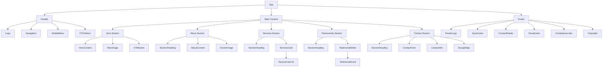
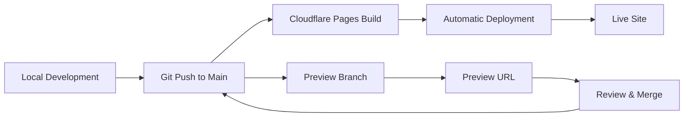

# Implementation Roadmap: Dr. Pooja's Smile Craft Dental Clinic

## Project Overview

A high-performance, responsive landing page for Dr. Pooja's Smile Craft Dental Clinic built with React and Vite. The project follows a strictly static architecture with no database requirements, optimized for fast loading, SEO, and deployment on Cloudflare Pages.

---

## Table of Contents

1. [Project Initialization](#1-project-initialization)
2. [Project Structure](#2-project-structure)
3. [Component Hierarchy](#3-component-hierarchy)
4. [Responsive Styling Strategy](#4-responsive-styling-strategy)
5. [SEO Optimization](#5-seo-optimization)
6. [Performance Optimization](#6-performance-optimization)
7. [Deployment Guide](#7-deployment-guide)
8. [Implementation Phases](#8-implementation-phases)

---

## 1. Project Initialization

### 1.1 Create Vite + React Project

```bash
npm create vite@latest smilecraft-landing -- --template react
cd smilecraft-landing
npm install
```

### 1.2 Install Core Dependencies

```bash
# Tailwind CSS and PostCSS
npm install -D tailwindcss postcss autoprefixer
npx tailwindcss init -p

# Additional utilities
npm install react-router-dom          # For routing between pages
npm install react-helmet-async        # For SEO meta tags
npm install @heroicons/react          # For icons
npm install framer-motion             # For animations
npm install react-hook-form           # For form handling
npm install clsx                      # For conditional classes
```

### 1.3 Configure Tailwind CSS

**tailwind.config.js:**
```javascript
export default {
  content: [
    "./index.html",
    "./src/**/*.{js,ts,jsx,tsx}",
  ],
  theme: {
    extend: {
      colors: {
        primary: {
          50: '#f0fdf4',
          100: '#dcfce7',
          200: '#bbf7d0',
          300: '#86efac',
          400: '#4ade80',
          500: '#22c55e',  // Main brand green
          600: '#16a34a',
          700: '#15803d',
          800: '#166534',
          900: '#14532d',
        },
        secondary: {
          50: '#eff6ff',
          100: '#dbeafe',
          200: '#bfdbfe',
          300: '#93c5fd',
          400: '#60a5fa',
          500: '#3b82f6',  // Accent blue
          600: '#2563eb',
          700: '#1d4ed8',
          800: '#1e40af',
          900: '#1e3a8a',
        },
      },
      fontFamily: {
        sans: ['Inter', 'system-ui', 'sans-serif'],
        display: ['Poppins', 'system-ui', 'sans-serif'],
      },
    },
  },
  plugins: [],
}
```

### 1.4 Configure Vite for Static Build

**vite.config.js:**
```javascript
import { defineConfig } from 'vite'
import react from '@vitejs/plugin-react'
import path from 'path'

export default defineConfig({
  plugins: [react()],
  resolve: {
    alias: {
      '@': path.resolve(__dirname, './src'),
      '@components': path.resolve(__dirname, './src/components'),
      '@assets': path.resolve(__dirname, './src/assets'),
      '@data': path.resolve(__dirname, './src/data'),
    },
  },
  build: {
    rollupOptions: {
      output: {
        manualChunks: {
          vendor: ['react', 'react-dom', 'react-router-dom'],
        },
      },
    },
  },
})
```

---

## 2. Project Structure

```
smilecraft-landing/
├── public/
│   ├── favicon.ico
│   ├── robots.txt
│   ├── sitemap.xml
│   └── images/
│       ├── hero/
│       ├── services/
│       ├── testimonials/
│       └── logo.svg
├── src/
│   ├── assets/
│   │   ├── fonts/
│   │   └── icons/
│   ├── components/
│   │   ├── common/
│   │   │   ├── Button.jsx
│   │   │   ├── Card.jsx
│   │   │   ├── Container.jsx
│   │   │   ├── SectionHeading.jsx
│   │   │   └── index.js
│   │   ├── layout/
│   │   │   ├── Header.jsx
│   │   │   ├── Footer.jsx
│   │   │   ├── Navigation.jsx
│   │   │   ├── MobileMenu.jsx
│   │   │   └── index.js
│   │   └── sections/
│   │       ├── Hero.jsx
│   │       ├── About.jsx
│   │       ├── Services.jsx
│   │       ├── ServiceCard.jsx
│   │       ├── Testimonials.jsx
│   │       ├── TestimonialCard.jsx
│   │       ├── Contact.jsx
│   │       ├── ContactForm.jsx
│   │       ├── Map.jsx
│   │       └── index.js
│   ├── data/
│   │   ├── services.js
│   │   ├── testimonials.js
│   │   └── clinicInfo.js
│   ├── hooks/
│   │   ├── useScrollPosition.js
│   │   └── useMediaQuery.js
│   ├── pages/
│   │   ├── Home.jsx
│   │   ├── PrivacyPolicy.jsx
│   │   ├── TermsOfService.jsx
│   │   └── Disclaimer.jsx
│   ├── styles/
│   │   └── index.css
│   ├── utils/
│   │   └── helpers.js
│   ├── App.jsx
│   └── main.jsx
├── index.html
├── package.json
├── tailwind.config.js
├── postcss.config.js
├── vite.config.js
└── README.md
```

---

## 3. Component Hierarchy

### 3.1 Visual Component Tree



### 3.2 Component Specifications

#### Common Components

| Component | Props | Description |
|-----------|-------|-------------|
| `Button` | variant, size, children, onClick, href, className | Reusable button with primary/secondary/outline variants |
| `Card` | children, className, hover | Container with shadow and optional hover effects |
| `Container` | children, className, size | Max-width wrapper for consistent spacing |
| `SectionHeading` | title, subtitle, centered | Consistent section titles with optional subtitle |

#### Layout Components

| Component | Props | Description |
|-----------|-------|-------------|
| `Header` | - | Sticky header with logo, nav, and CTA |
| `Navigation` | items | Desktop navigation links |
| `MobileMenu` | isOpen, onClose, items | Slide-out mobile navigation |
| `Footer` | - | Full footer with all required sections |

#### Section Components

| Component | Props | Description |
|-----------|-------|-------------|
| `Hero` | - | Full-width hero with image, text, and CTA |
| `About` | - | Dr. Pooja introduction section |
| `Services` | - | Grid of 6 service cards |
| `ServiceCard` | icon, title, description | Individual service display |
| `Testimonials` | - | Patient reviews carousel/grid |
| `TestimonialCard` | name, review, rating | Individual testimonial |
| `Contact` | - | Contact form + info + map |
| `ContactForm` | onSubmit | Lead capture form |
| `Map` | - | Google Maps embed |

---

## 4. Responsive Styling Strategy

### 4.1 Breakpoint System

Using Tailwind CSS default breakpoints:

| Breakpoint | Min Width | Target Devices |
|------------|-----------|----------------|
| `sm` | 640px | Large phones, small tablets |
| `md` | 768px | Tablets |
| `lg` | 1024px | Small laptops |
| `xl` | 1280px | Desktops |
| `2xl` | 1536px | Large screens |

### 4.2 Mobile-First Approach

```css
/* Base styles (mobile) */
.service-grid {
  @apply grid grid-cols-1 gap-4;
}

/* Tablet */
@screen md {
  .service-grid {
    @apply grid-cols-2 gap-6;
  }
}

/* Desktop */
@screen lg {
  .service-grid {
    @apply grid-cols-3 gap-8;
  }
}
```

### 4.3 Component-Specific Responsive Patterns

#### Header
- Mobile: Hamburger menu, logo centered
- Desktop: Full navigation, logo left, CTA right

#### Hero Section
- Mobile: Stacked layout, image below text
- Desktop: Side-by-side, image right

#### Services Grid
- Mobile: 1 column
- Tablet: 2 columns
- Desktop: 3 columns

#### Contact Section
- Mobile: Stacked (form, info, map)
- Desktop: 2-column (form left, info + map right)

#### Footer
- Mobile: Single column, stacked sections
- Desktop: 4-column grid

### 4.4 Typography Scale

```javascript
// Tailwind config extension
fontSize: {
  'display-lg': ['4rem', { lineHeight: '1.1', fontWeight: '700' }],
  'display-md': ['3rem', { lineHeight: '1.2', fontWeight: '700' }],
  'display-sm': ['2rem', { lineHeight: '1.3', fontWeight: '600' }],
  'body-lg': ['1.125rem', { lineHeight: '1.75' }],
  'body-md': ['1rem', { lineHeight: '1.75' }],
  'body-sm': ['0.875rem', { lineHeight: '1.5' }],
}
```

---

## 5. SEO Optimization

### 5.1 Meta Tags Strategy

**index.html:**
```html
<!DOCTYPE html>
<html lang="en">
<head>
  <meta charset="UTF-8" />
  <meta name="viewport" content="width=device-width, initial-scale=1.0" />
  
  <!-- Primary Meta Tags -->
  <title>Dr. Pooja's Smile Craft Dental Clinic | Ezhupunna, Kerala</title>
  <meta name="title" content="Dr. Pooja's Smile Craft Dental Clinic | Ezhupunna, Kerala" />
  <meta name="description" content="Crafting Healthy Smiles - Expert dental care including smile design, aligners, root canal, implants, teeth whitening, and kids dentistry in Ezhupunna, Kerala." />
  <meta name="keywords" content="dentist Ezhupunna, dental clinic Kerala, smile design, dental implants, root canal treatment, teeth whitening, kids dentistry, Dr Pooja dentist" />
  
  <!-- Open Graph / Facebook -->
  <meta property="og:type" content="website" />
  <meta property="og:url" content="https://smilecraft.in/" />
  <meta property="og:title" content="Dr. Pooja's Smile Craft Dental Clinic" />
  <meta property="og:description" content="Crafting Healthy Smiles - Your Path to a Perfect Smile" />
  <meta property="og:image" content="https://smilecraft.in/images/og-image.jpg" />
  
  <!-- Twitter -->
  <meta property="twitter:card" content="summary_large_image" />
  <meta property="twitter:url" content="https://smilecraft.in/" />
  <meta property="twitter:title" content="Dr. Pooja's Smile Craft Dental Clinic" />
  <meta property="twitter:description" content="Crafting Healthy Smiles - Your Path to a Perfect Smile" />
  <meta property="twitter:image" content="https://smilecraft.in/images/og-image.jpg" />
  
  <!-- Canonical URL -->
  <link rel="canonical" href="https://smilecraft.in/" />
  
  <!-- Favicon -->
  <link rel="icon" type="image/svg+xml" href="/favicon.svg" />
  <link rel="apple-touch-icon" href="/apple-touch-icon.png" />
</head>
```

### 5.2 Structured Data (JSON-LD)

```html
<script type="application/ld+json">
{
  "@context": "https://schema.org",
  "@type": "Dentist",
  "name": "Dr. Pooja's Smile Craft Dental Clinic",
  "image": "https://smilecraft.in/images/clinic.jpg",
  "url": "https://smilecraft.in",
  "telephone": "+91 79070 06842",
  "address": {
    "@type": "PostalAddress",
    "streetAddress": "Sreenarayanapuram, Opposite Family Health Center",
    "addressLocality": "Ezhupunna",
    "addressRegion": "Kerala",
    "addressCountry": "IN"
  },
  "geo": {
    "@type": "GeoCoordinates",
    "latitude": "YOUR_LATITUDE",
    "longitude": "YOUR_LONGITUDE"
  },
  "openingHoursSpecification": [
    {
      "@type": "OpeningHoursSpecification",
      "dayOfWeek": ["Monday", "Tuesday", "Wednesday", "Thursday", "Friday", "Saturday"],
      "opens": "09:00",
      "closes": "19:00"
    },
    {
      "@type": "OpeningHoursSpecification",
      "dayOfWeek": "Sunday",
      "opens": "09:00",
      "closes": "15:00"
    }
  ],
  "priceRange": "$$",
  "servesCuisine": "Dental Services"
}
</script>
```

### 5.3 robots.txt

```
User-agent: *
Allow: /

Sitemap: https://smilecraft.in/sitemap.xml
```

### 5.4 sitemap.xml

```xml
<?xml version="1.0" encoding="UTF-8"?>
<urlset xmlns="http://www.sitemaps.org/schemas/sitemap/0.9">
  <url>
    <loc>https://smilecraft.in/</loc>
    <lastmod>2026-01-30</lastmod>
    <changefreq>weekly</changefreq>
    <priority>1.0</priority>
  </url>
  <url>
    <loc>https://smilecraft.in/privacy-policy</loc>
    <lastmod>2026-01-30</lastmod>
    <changefreq>monthly</changefreq>
    <priority>0.3</priority>
  </url>
  <url>
    <loc>https://smilecraft.in/terms-of-service</loc>
    <lastmod>2026-01-30</lastmod>
    <changefreq>monthly</changefreq>
    <priority>0.3</priority>
  </url>
  <url>
    <loc>https://smilecraft.in/disclaimer</loc>
    <lastmod>2026-01-30</lastmod>
    <changefreq>monthly</changefreq>
    <priority>0.3</priority>
  </url>
</urlset>
```

### 5.5 Semantic HTML Structure

```html
<header role="banner">...</header>
<main role="main">
  <section id="hero" aria-label="Welcome">...</section>
  <section id="about" aria-labelledby="about-heading">...</section>
  <section id="services" aria-labelledby="services-heading">...</section>
  <section id="testimonials" aria-labelledby="testimonials-heading">...</section>
  <section id="contact" aria-labelledby="contact-heading">...</section>
</main>
<footer role="contentinfo">...</footer>
```

---

## 6. Performance Optimization

### 6.1 Image Optimization

- Use WebP format with JPEG fallback
- Implement lazy loading for below-fold images
- Use responsive images with srcset
- Compress all images (target < 100KB for hero)

```jsx
<picture>
  <source srcSet="/images/hero.webp" type="image/webp" />
  
</picture>
```

### 6.2 Code Splitting

```javascript
// Lazy load compliance pages
const PrivacyPolicy = lazy(() => import('./pages/PrivacyPolicy'));
const TermsOfService = lazy(() => import('./pages/TermsOfService'));
const Disclaimer = lazy(() => import('./pages/Disclaimer'));
```

### 6.3 Font Loading Strategy

```html
<link rel="preconnect" href="https://fonts.googleapis.com">
<link rel="preconnect" href="https://fonts.gstatic.com" crossorigin>
<link href="https://fonts.googleapis.com/css2?family=Inter:wght@400;500;600&family=Poppins:wght@600;700&display=swap" rel="stylesheet">
```

### 6.4 Performance Targets

| Metric | Target |
|--------|--------|
| First Contentful Paint | < 1.5s |
| Largest Contentful Paint | < 2.5s |
| Time to Interactive | < 3.5s |
| Cumulative Layout Shift | < 0.1 |
| Total Bundle Size | < 200KB (gzipped) |

---

## 7. Deployment Guide

### 7.1 Cloudflare Pages Setup

#### Step 1: Prepare Repository

```bash
# Initialize git if not already done
git init
git add .
git commit -m "Initial commit: Smile Craft landing page"

# Push to GitHub
git remote add origin https://github.com/YOUR_USERNAME/smilecraft-landing.git
git push -u origin main
```

#### Step 2: Connect to Cloudflare Pages

1. Log in to Cloudflare Dashboard
2. Navigate to **Pages** > **Create a project**
3. Select **Connect to Git**
4. Authorize GitHub and select the repository
5. Configure build settings:

| Setting | Value |
|---------|-------|
| Framework preset | Vite |
| Build command | `npm run build` |
| Build output directory | `dist` |
| Root directory | `/` |
| Node.js version | 18 |

#### Step 3: Environment Variables (if needed)

```
VITE_GOOGLE_MAPS_API_KEY=your_api_key_here
```

#### Step 4: Custom Domain Setup

1. Go to **Custom domains** in your Pages project
2. Click **Set up a custom domain**
3. Enter your domain (e.g., `smilecraft.in`)
4. Add the provided DNS records to your domain registrar:
   - CNAME record pointing to `your-project.pages.dev`
5. Enable **Always Use HTTPS**

#### Step 5: Configure Headers and Redirects

**public/_headers:**
```
/*
  X-Frame-Options: DENY
  X-Content-Type-Options: nosniff
  Referrer-Policy: strict-origin-when-cross-origin
  Permissions-Policy: camera=(), microphone=(), geolocation=()

/assets/*
  Cache-Control: public, max-age=31536000, immutable

/*.html
  Cache-Control: public, max-age=0, must-revalidate
```

**public/_redirects:**
```
# SPA fallback
/*    /index.html   200
```

### 7.2 Deployment Workflow



### 7.3 Post-Deployment Checklist

- [ ] Verify all pages load correctly
- [ ] Test contact form submission
- [ ] Check Google Maps embed
- [ ] Validate mobile responsiveness
- [ ] Run Lighthouse audit (target 90+ scores)
- [ ] Test all internal links
- [ ] Verify SSL certificate is active
- [ ] Submit sitemap to Google Search Console
- [ ] Test Facebook ad compliance pages

---

## 8. Implementation Phases

### Phase 1: Project Setup
- Initialize Vite + React project
- Configure Tailwind CSS
- Set up project structure
- Create path aliases
- Add base styles and fonts

### Phase 2: Core Components
- Build common components (Button, Card, Container)
- Create layout components (Header, Footer, Navigation)
- Implement mobile menu functionality

### Phase 3: Landing Page Sections
- Hero section with CTA
- About section with Dr. Pooja intro
- Services grid with 6 service cards
- Testimonials section with placeholder reviews
- Contact section with form and map

### Phase 4: Compliance Pages
- Privacy Policy page
- Terms of Service page
- Disclaimer page
- Footer links integration

### Phase 5: SEO & Performance
- Add meta tags and structured data
- Create robots.txt and sitemap.xml
- Optimize images
- Implement lazy loading
- Performance testing and optimization

### Phase 6: Testing & QA
- Cross-browser testing
- Mobile responsiveness testing
- Form validation testing
- Accessibility audit
- Performance audit

### Phase 7: Deployment
- Set up Cloudflare Pages
- Configure custom domain
- Set up headers and redirects
- Final deployment
- Post-deployment verification

---

## Data Files Reference

### services.js
```javascript
export const services = [
  {
    id: 'smile-design',
    title: 'Smile Design',
    description: 'Comprehensive aesthetic transformations for your perfect smile.',
    icon: 'SparklesIcon',
  },
  {
    id: 'aligners',
    title: 'Aligners & Orthodontics',
    description: 'Clear aligners and traditional braces for teeth straightening.',
    icon: 'AdjustmentsIcon',
  },
  {
    id: 'root-canal',
    title: 'Root Canal Treatment',
    description: 'Advanced endodontic care for saving damaged teeth.',
    icon: 'ShieldCheckIcon',
  },
  {
    id: 'implants',
    title: 'Dental Implants',
    description: 'Permanent solutions for missing teeth.',
    icon: 'CubeIcon',
  },
  {
    id: 'whitening',
    title: 'Teeth Whitening',
    description: 'Professional brightening services for a radiant smile.',
    icon: 'SunIcon',
  },
  {
    id: 'kids-dentistry',
    title: 'Kids Dentistry',
    description: 'Specialized, gentle care for children.',
    icon: 'HeartIcon',
  },
];
```

### clinicInfo.js
```javascript
export const clinicInfo = {
  name: "Dr. Pooja's Smile Craft Dental Clinic",
  slogan: "Crafting Healthy Smiles",
  founder: "Dr. Pooja",
  phone: "+91 79070 06842",
  address: {
    street: "Sreenarayanapuram, Opposite Family Health Center",
    city: "Ezhupunna",
    state: "Kerala",
    country: "India",
  },
  hours: {
    weekdays: "9:00 AM – 7:00 PM",
    sunday: "9:00 AM – 3:00 PM",
  },
  social: {
    facebook: "https://facebook.com/smilecraftdental",
    instagram: "https://instagram.com/smilecraftdental",
    whatsapp: "https://wa.me/917907006842",
  },
};
```

---

## Summary

This roadmap provides a complete blueprint for building Dr. Pooja's Smile Craft Dental Clinic landing page. The implementation follows modern best practices with:

- **React + Vite** for fast development and optimized builds
- **Tailwind CSS** for responsive, utility-first styling
- **Modular component architecture** for maintainability
- **SEO optimization** with meta tags, structured data, and semantic HTML
- **Performance focus** with lazy loading, code splitting, and image optimization
- **Cloudflare Pages deployment** for global CDN, SSL, and fast delivery
- **Facebook ad compliance** with required legal pages

The project is designed to be fully static, requiring no backend or database, making it ideal for a professional dental clinic web presence.
